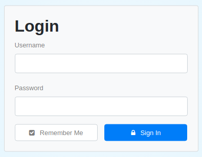
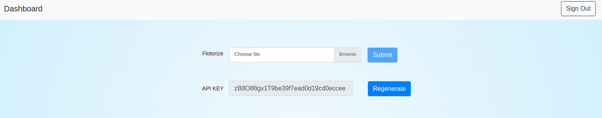

## Login system and API key generation

It was built using a [NodeJS package](https://github.com/braitsch/node-login).

The above package was installed locally and then the code was edited for building **registration of user and login** feature. For  building the **generation of api key** and **flotorize** feature the code was added.

User just need to put a **username** and **password** to register. The username is encrypted using AES-256 algorithm and stored in **MongoDB database**.
After registration an API key was generated using SHA-256 algorithm and assigned to the user by storing with the respective username in the database. 

After login the dashboard page appears. Here facility of **flotorize** and **regeneration of API key** are present. User can also see the api key assigned.

User can **flotorize** i.e store the sha-512 hash value of a file in the FLO blockchain.

Screenshots can be seen below.

Login page
-----------

Dashboard
-----------

